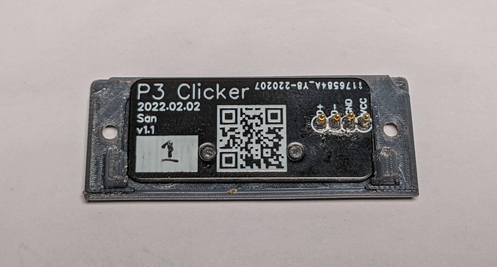

::: slot footer
CC-BY-4.0 @2022 San

沪ICP备18033591号-1
:::

## 简介

P3 Clicker 是为 GPD Pocket 3 开发的一款可替换模块。

起因是由于 GPD Pocket 3 侧面没有按键，当电脑处于平板模式时，无法方便地调节音量或电源。所以在其背后增加三个按键解决问题。

## 硬件

P3 Clicker 主控芯片采用 ATtiny85 单片机，模拟 USB 1.1 键盘设备。

PCB（可能有略微变动）：

成品图（可能有略微变动）：

外壳采用 3D 打印，模型文件请访问 [GitHub](https://github.com/zhujunsan/p3-clicker) 仓库，查看 hardware 文件夹

## 软件

P3 Clicker 基于 Arduino + DigistumpArduino 开发

三个按键分别为 __休眠/唤醒__，__音量+__，__音量-__

> 音量 +/- 键的按下和释放分别会触发此二者键位的 keyDown 和 keyUp 事件；
>
> 休眠/唤醒 按钮按下时，因无法分辨是否电脑处于休眠中（知道如何区分的大神还烦请在 GitHub issue 区赐教），均会触发 USB 设备唤醒信号 和 休眠按键点击事件，实测能达到休眠/唤醒效果。

代码请访问 [GitHub](https://github.com/zhujunsan/p3-clicker) 仓库，查看 software 文件夹

## 其他

此项目离不开以下开源项目：

- [micronucleus](https://github.com/micronucleus/micronucleus)
- [ArminJo/micronucleus-firmware](https://github.com/ArminJo/micronucleus-firmware)
- [Adafruit-Trinket-USB](https://github.com/adafruit/Adafruit-Trinket-USB)
- [DigistumpArduino](https://github.com/digistump/DigistumpArduino)
- [ArminJo/DigistumpArduino](https://github.com/ArminJo/DigistumpArduino)

你如果对其他模块感兴趣，可以查看 [P3-LTE](https://p3-lte.wulige.com)
